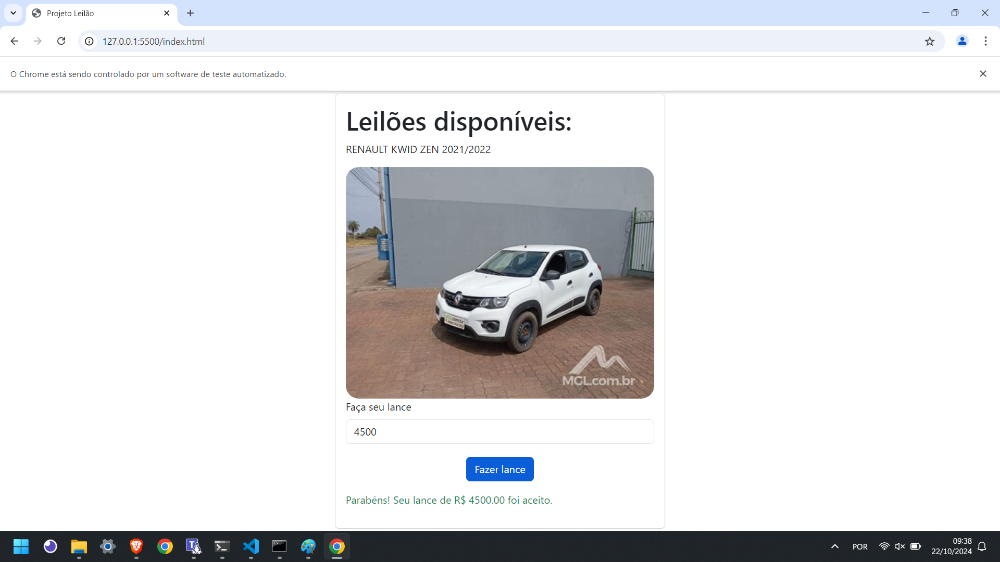
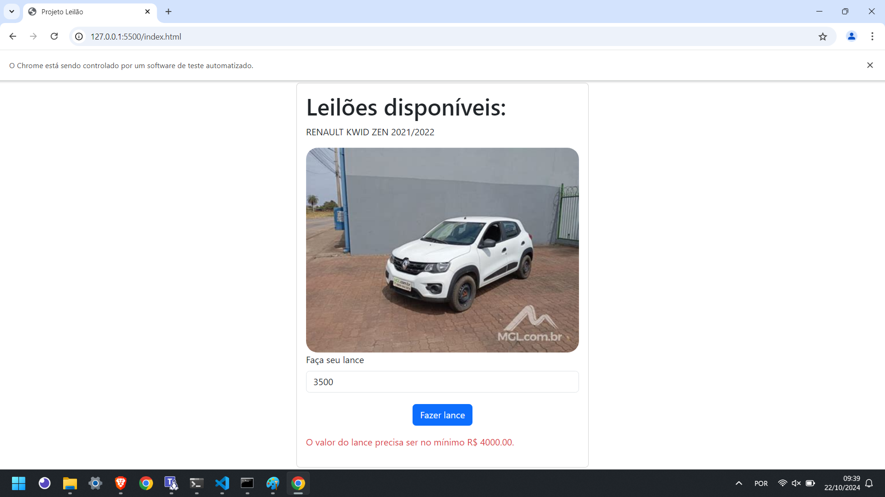

# TestesAutomatizados
Atividade sobre testes automatizados utilizando Python e Selenium

# ⚠️ Atenção ⚠️
Este script foi pensado para a versão 130.0.6723.59 do Google Chrome, caso queira testar em uma versão diferente será necessario baixar a versão do ChromeWebDriver equivalente a sua versão do Google Chrome e editar esse trecho do script na linha 13 alterando para o caminho do seu ChromeWebDriver

```python
service = Service('./chromedriver-win64/chromedriver.exe')  # Insira o caminho do seu ChromeDriver
```

Download do [ChromeWebDriver](https://googlechromelabs.github.io/chrome-for-testing/)

## Preparando ambiente
### Ferramentas necessárias:
- Python
- pip
- VS Code
- Extensão Live Server para VS Code
- Google Chrome 130.0.6723.59
- ChromeWebDriver 130.0.6723.58

## Rodando projeto
Após clonar o repositório, abra a pasta com o VS Code e rode o index.html usando o live server, agora abra o cmd como administrador na pasta clonada e rode o seguinte comando
```python
pip install selenium && python Script.py
```
## Testes
Sucesso



Falha



